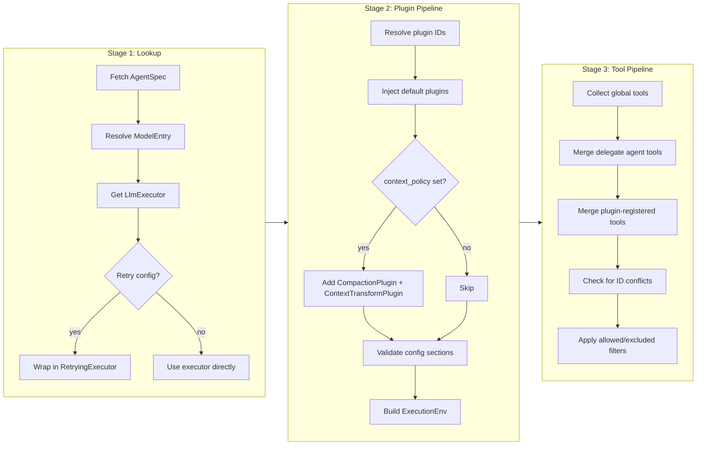

# Agent Resolution

When `runtime.run(request)` is called, the `agent_id` in the request must be resolved into a fully wired `ResolvedAgent` -- a struct that holds live references to an LLM executor, tools, plugins, and an execution environment. This resolution happens on every `resolve()` call; nothing is cached or shared between runs. This page describes the three-stage resolution pipeline and the builder that feeds it.

## Pipeline Overview

Resolution is a pure function: `(RegistrySet, agent_id) -> ResolvedAgent`. It proceeds through three sequential stages:

Any failure at any stage produces a `ResolveError` and aborts. The pipeline never returns a partial result.

## Stage 1: Lookup

The first stage fetches the raw data from registries:

1. **AgentSpec** -- looked up from `AgentSpecRegistry` by `agent_id`. If the spec has an `endpoint` field (remote A2A agent), resolution fails with `RemoteAgentNotDirectlyRunnable` -- remote agents can only be used as delegates, not run directly.

2. **ModelEntry** -- the spec's `model` field (a string ID like `"gpt-4"`) is resolved through `ModelRegistry` into a `ModelEntry`, which maps it to a provider ID and an actual model name (e.g., provider `"openai"`, model name `"gpt-4-turbo"`).

3. **LlmExecutor** -- the provider ID from the model entry is resolved through `ProviderRegistry` to get a live `LlmExecutor` instance.

4. **Retry decoration** -- if the agent spec contains a `RetryConfigKey` section with `max_retries > 0` or non-empty `fallback_models`, the executor is wrapped in a `RetryingExecutor` decorator.

## Stage 2: Plugin Pipeline

The second stage assembles the plugin chain and builds the execution environment.

### Plugin resolution

Plugins listed in `AgentSpec.plugin_ids` are resolved by ID from `PluginSource`. A missing plugin produces `ResolveError::PluginNotFound`.

### Default plugin injection

After resolving user-declared plugins, the pipeline injects runtime-required default plugins. These are always present regardless of agent configuration:

- **`LoopActionHandlersPlugin`** -- registers the core action handlers that the runtime loop uses to process tool calls, emit events, and manage step transitions. Without this plugin, the loop cannot function.

- **`MaxRoundsPlugin`** -- enforces the `max_rounds` stop condition configured on the agent spec. Injected with the spec's `max_rounds` value. Prevents runaway loops.

### Conditional plugins

These plugins are added only when `AgentSpec.context_policy` is set:

- **`CompactionPlugin`** -- manages context window compaction (summarization of old messages when the context grows too large). Created with the `CompactionConfigKey` section from the spec, falling back to defaults if absent.

- **`ContextTransformPlugin`** -- applies context window policy transforms (token counting, truncation, prompt caching) before each inference request. Created with the `context_policy` value.

### Building ExecutionEnv

After the plugin list is finalized, `ExecutionEnv::from_plugins()` calls each plugin's `register()` method with a `PluginRegistrar`. Plugins use the registrar to declare:

- Phase hooks (per-phase callbacks)
- Scheduled action handlers
- Effect handlers
- Request transforms
- State key registrations
- Tools

The result is an `ExecutionEnv` -- see [ExecutionEnv](#executionenv) below.

### Config validation

Plugins can declare `config_schemas()`, returning a list of `ConfigSchema` entries. Each entry associates a section key with a JSON Schema. During resolution, every declared schema is validated against the corresponding entry in `AgentSpec.sections`:

- **Section present** -- validated against the JSON Schema. Failure produces `ResolveError::InvalidPluginConfig`.
- **Section absent** -- allowed. Plugins are expected to use sensible defaults.
- **Section present but unclaimed** -- no plugin declared a schema for it. The pipeline logs a warning (possible typo in configuration).

## Stage 3: Tool Pipeline

The third stage collects tools from all sources and produces the final tool set.

### Tool sources

Tools are merged in this order:

1. **Global tools** -- all tools registered in `ToolRegistry` via the builder (e.g., `builder.with_tool("search", search_tool)`).

2. **Delegate agent tools** -- for each agent ID in `AgentSpec.delegates`, the pipeline creates an `AgentTool`. If the delegate has an `endpoint` (remote), it creates a remote A2A tool. If local, it creates a local tool backed by a resolver. Delegate tools require the `a2a` feature flag; without it, delegates are silently ignored with a warning.

3. **Plugin-registered tools** -- tools declared by plugins during `register()`, stored in `ExecutionEnv.tools`.

### Conflict detection

If a plugin-registered tool has the same ID as a global tool, resolution fails with `ResolveError::ToolIdConflict`. This is intentional -- silent overwriting would be a source of hard-to-debug issues.

### Filtering

After merging, the spec's `allowed_tools` and `excluded_tools` fields are applied:

- `allowed_tools = None` -- all tools are kept.
- `allowed_tools = Some(list)` -- only tools whose ID appears in the list are kept. Everything else is dropped.
- `excluded_tools` -- any tool whose ID appears in this list is removed, even if it was in the allow list.

## ExecutionEnv

`ExecutionEnv` is the per-resolve product of the plugin pipeline. It is **not** global or shared -- each `resolve()` call builds a fresh one. Its contents:

| Field | Type | Purpose |
|---|---|---|
| `phase_hooks` | `HashMap<Phase, Vec<TaggedPhaseHook>>` | Hooks invoked at each phase boundary |
| `scheduled_action_handlers` | `HashMap<String, ScheduledActionHandlerArc>` | Named handlers for scheduled/deferred actions |
| `effect_handlers` | `HashMap<String, EffectHandlerArc>` | Named handlers for side effects |
| `request_transforms` | `Vec<TaggedRequestTransform>` | Transforms applied to inference requests before the LLM call |
| `key_registrations` | `Vec<KeyRegistration>` | State keys to install into the state store at run start |
| `tools` | `HashMap<String, Arc<dyn Tool>>` | Plugin-provided tools (merged into the main tool set in Stage 3) |
| `plugins` | `Vec<Arc<dyn Plugin>>` | Plugin references for lifecycle hooks (`on_activate`/`on_deactivate`) |

Each `TaggedPhaseHook` and `TaggedRequestTransform` carries its owning plugin ID for diagnostics and filtering.

## AgentRuntimeBuilder

The builder (`AgentRuntimeBuilder`) is the standard way to construct an `AgentRuntime`. It accumulates five registries:

| Registry | Builder method | Purpose |
|---|---|---|
| `MapAgentSpecRegistry` | `with_agent_spec()` / `with_agent_specs()` | Agent definitions |
| `MapToolRegistry` | `with_tool()` | Global tools |
| `MapModelRegistry` | `with_model()` | Model ID to provider + model name mappings |
| `MapProviderRegistry` | `with_provider()` | LLM executor instances |
| `MapPluginSource` | `with_plugin()` | Plugin instances |

### Error handling

The builder uses **deferred error collection**. Each `with_*` call that detects a conflict (duplicate ID) pushes a `BuildError` onto an internal error list instead of returning `Result`. The first collected error surfaces when `build()` or `build_unchecked()` is called.

### Validation

`build()` performs a dry-run resolve for every registered agent spec after constructing the runtime. If any agent fails to resolve (missing model, missing provider, missing plugin), the error is collected and returned as `BuildError::ValidationFailed`. This catches configuration errors at startup rather than at first request.

`build_unchecked()` skips this validation. Use it only when you need lazy resolution or when agents will be added dynamically after construction.

### Remote agents (A2A)

When the `a2a` feature is enabled, the builder supports `with_remote_agents()` to register remote A2A endpoints. These are wrapped in a `CompositeAgentSpecRegistry` that combines local and remote agent sources. Remote agents are discovered asynchronously via `build_and_discover()`.

## See Also

- [Architecture](./architecture.md) -- system layers and request sequence
- [Run Lifecycle and Phases](./run-lifecycle-and-phases.md) -- what happens after resolution
- [Tool and Plugin Boundary](./tool-and-plugin-boundary.md) -- when to use tools vs plugins
- [Design Tradeoffs](./design-tradeoffs.md) -- rationale for key decisions
