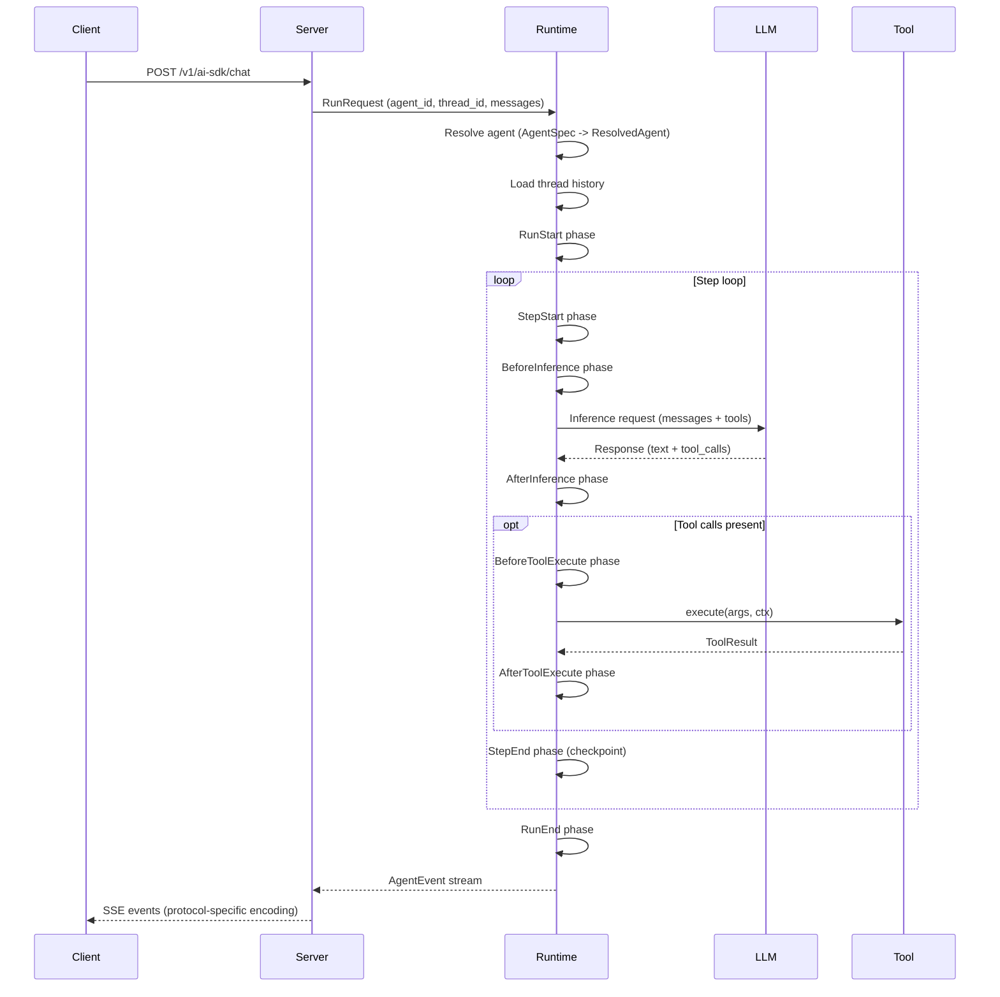

# Architecture

Awaken is organized around one runtime core plus three surrounding surfaces: contract types, server/storage adapters, and optional extensions. The important distinction is not just crate boundaries, but where decisions are made.

```text
Application assembly
  register tools / models / providers / plugins / AgentSpec
        |
        v
AgentRuntime
  resolve AgentSpec -> ResolvedAgent
  build ExecutionEnv from plugins
  run the phase loop
  expose cancel / decision control for active runs
        |
        v
Server + storage surfaces
  HTTP routes, mailbox, SSE replay, protocol adapters,
  thread/run persistence, profile storage
```

**Contract layer** -- `awaken-contract` defines the shared types used everywhere: `AgentSpec`, `ModelSpec`, `ProviderSpec`, `Tool`, `AgentEvent`, transport traits, and the typed state model. This is the vocabulary that the rest of the system speaks.

**Runtime core** -- `awaken-runtime` is the orchestration layer. It resolves agent IDs to fully wired configurations (`ResolvedAgent`), builds an `ExecutionEnv` from plugins, manages active runs, and delegates execution to the loop runner plus phase engine.

**Server and persistence surfaces** -- `awaken-server` turns the runtime into HTTP and SSE endpoints, mailbox-backed background execution, and protocol adapters. `awaken-stores` provides concrete persistence backends for threads and runs. `awaken-ext-*` crates extend the runtime at phase and tool boundaries without changing the core loop.

## Request Sequence

The following diagram shows a representative request flowing through the system:



## Phase-Driven Execution Loop

Every run proceeds through a fixed sequence of phases. Plugins register hooks that run at each phase boundary, giving them control over inference parameters, tool execution, state mutations, and termination logic.

```text
RunStart -> [StepStart -> BeforeInference -> AfterInference
             -> BeforeToolExecute -> AfterToolExecute -> StepEnd]* -> RunEnd
```

The step loop repeats until one of these conditions fires:

- The LLM returns a response with no tool calls (`NaturalEnd`).
- A plugin or stop condition requests termination (`Stopped`, `BehaviorRequested`).
- A tool call suspends waiting for external input (`Suspended`).
- The run is cancelled externally (`Cancelled`).
- An error occurs (`Error`).

At each phase boundary, the loop checks the cancellation token and the run lifecycle state before proceeding.

## Repository Map

```text
awaken
├─ awaken-contract
│  ├─ registry specs
│  ├─ tool / executor / event / transport contracts
│  └─ state model
├─ awaken-runtime
│  ├─ builder + registries + resolve pipeline
│  ├─ AgentRuntime control plane
│  ├─ loop_runner + phase engine
│  ├─ execution / context / policies / profile
│  └─ runtime extensions (handoff, local A2A, background)
├─ awaken-server
│  ├─ routes + config API + mailbox + services
│  ├─ protocols: ai_sdk_v6 / ag_ui / a2a / mcp / acp-stdio
│  └─ transport: SSE relay / replay buffer / transcoder
├─ awaken-stores
└─ awaken-ext-*
```

## Design Intent

Three principles guide the architecture:

**Snapshot isolation** -- Phase hooks never see partially applied state. They read from an immutable snapshot and write to a `MutationBatch`. The batch is applied atomically after all hooks for a phase have converged. This eliminates data races between concurrent hooks and makes hook execution order irrelevant for correctness.

**Append-style persistence** -- Thread messages are append-only. State is checkpointed at step boundaries. This makes it possible to replay a run from any checkpoint and produces a deterministic audit trail.

**Transport independence** -- The runtime emits `AgentEvent` values through an `EventSink` trait. Protocol adapters (`AiSdkEncoder`, `AgUiEncoder`) transcode these events into wire formats. The runtime has no knowledge of HTTP, SSE, or any specific protocol. Adding a new protocol means implementing a new encoder -- the runtime does not change.

## See Also

- [Run Lifecycle and Phases](./run-lifecycle-and-phases.md) -- phase execution model
- [State and Snapshot Model](./state-and-snapshot-model.md) -- snapshot isolation details
- [Design Tradeoffs](./design-tradeoffs.md) -- rationale for key architectural decisions
- [Tool and Plugin Boundary](./tool-and-plugin-boundary.md) -- plugin vs tool design
