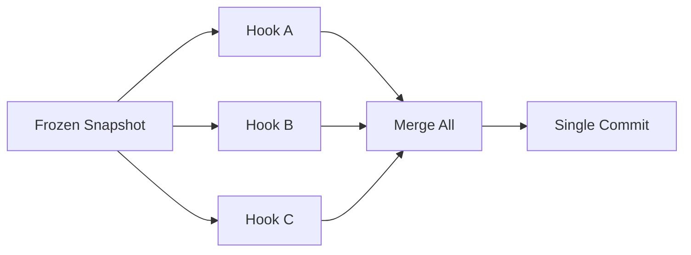
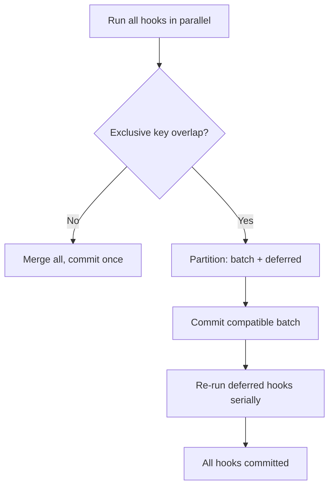
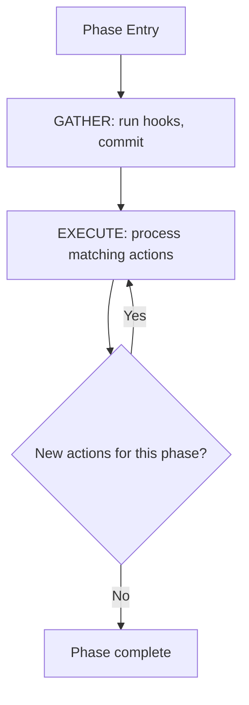
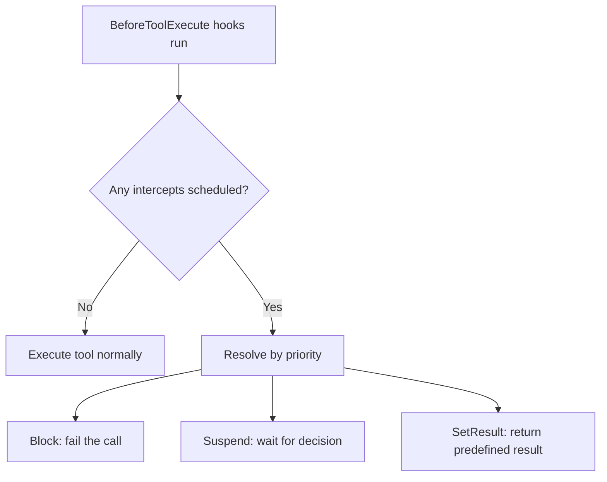

# Plugin System Internals

This page covers the internal mechanics of the plugin system: how plugins are registered and activated, how hooks execute and resolve conflicts, how the phase convergence loop works, and how request transforms, effects, inference overrides, and tool intercepts behave at runtime.

For the high-level boundary between tools and plugins, see [Tool and Plugin Boundary](./tool-and-plugin-boundary.md). For the phase lifecycle, see [Run Lifecycle and Phases](./run-lifecycle-and-phases.md).

## Plugin Registration vs Activation

When a plugin is loaded, its `register()` method is called with a `PluginRegistrar`. The plugin declares two categories of components:

**Structural components** are always available regardless of activation state:

- State keys (`register_key::<K>()`)
- Scheduled action handlers (`register_scheduled_action::<A, H>()`)
- Effect handlers (`register_effect::<E, H>()`)

**Behavioral components** are only active when the plugin passes the activation filter:

- Phase hooks (`register_phase_hook()`)
- Tools (`register_tool()`)
- Request transforms (`register_request_transform()`)

Activation is controlled by `AgentSpec.active_hook_filter`:

| `active_hook_filter` value | Behavior |
|---|---|
| Empty (default) | All plugins' behavioral components are active |
| Non-empty set | Only plugins whose ID is in the set contribute behavioral components |

This separation enables infrastructure plugins (state management, action handlers, effect handlers) to exist without impacting execution flow. A logging plugin that only registers an effect handler, for example, never needs to appear in `active_hook_filter` -- its handler fires whenever any plugin emits the corresponding effect.

The filtering happens in `PhaseRuntime::filter_hooks()`:

```rust,ignore
fn filter_hooks<'a>(env: &'a ExecutionEnv, ctx: &PhaseContext) -> Vec<&'a TaggedPhaseHook> {
    let hooks = env.hooks_for_phase(ctx.phase);
    let active_hook_filter = &ctx.agent_spec.active_hook_filter;
    hooks
        .iter()
        .filter(|tagged| {
            active_hook_filter.is_empty()
                || active_hook_filter.contains(&tagged.plugin_id)
        })
        .collect()
}
```

## Hook Ordering and Conflict Resolution

Multiple plugins can register hooks for the same `Phase`. The engine runs them through a two-stage process implemented in `gather_and_commit_hooks()` (`crates/awaken-runtime/src/phase/engine.rs`).

### Fast path: parallel execution, single commit

All hooks for a phase run in parallel against a **frozen snapshot**. Each hook receives the same snapshot and produces a `StateCommand`. If no hook writes to a key with `MergeStrategy::Exclusive` that another hook also writes to, all commands are merged and committed in a single batch.



### Conflict fallback: partition and serial retry

If two or more hooks write to the same `Exclusive` key, the engine detects the conflict and falls back:

1. **Partition** -- Walk commands in registration order. Greedily add each command to a "compatible batch" if its `Exclusive` keys do not overlap with keys already in the batch. Otherwise, defer the hook.
2. **Commit the batch** -- The compatible batch is merged and committed.
3. **Serial re-execution** -- Deferred hooks are re-run one at a time, each against a **fresh snapshot** that includes the results of all prior commits.



Because hooks are pure functions (frozen snapshot in, `StateCommand` out, no side effects), re-execution on conflict is always safe. The deferred hooks see the updated state from the batch commit, so they produce correct results even when the original parallel execution would have conflicted.

See [State and Snapshot Model](./state-and-snapshot-model.md) for details on `MergeStrategy` and snapshot isolation.

## Phase Convergence Loop

Each phase runs a **GATHER then EXECUTE** loop that converges when no new work remains.

### GATHER stage

Run all active hooks in parallel (with conflict resolution as described above). Hooks produce `StateCommand` values that may contain:

- State mutations (key updates)
- Scheduled actions (to be processed in the EXECUTE stage)
- Effects (dispatched immediately after commit)

### EXECUTE stage

Process pending scheduled actions whose `Phase` matches the current phase and whose action key has a registered handler. Each action handler runs against a fresh snapshot and produces its own `StateCommand`, which may schedule **new** actions for the same phase.

If new matching actions appear after processing, the loop repeats:



The loop is bounded by `DEFAULT_MAX_PHASE_ROUNDS` (16). If the action count does not converge within this limit, the engine returns `StateError::PhaseRunLoopExceeded`. This prevents infinite reactive chains while allowing legitimate multi-step action cascades.

This convergence design enables reactive patterns: a permission check action can schedule a suspend action in the same `BeforeToolExecute` phase, and both are processed before the phase completes.

## Request Transform Hooks

Plugins can register `InferenceRequestTransform` implementations via `registrar.register_request_transform()`. Transforms modify the `InferenceRequest` before it reaches the LLM executor.

Use cases:

- **System prompt injection** -- append context, instructions, or reminders to the system message
- **Tool list modification** -- filter, reorder, or augment the tool descriptors sent to the LLM
- **Parameter overrides** -- adjust temperature, max tokens, or other inference parameters

Transforms run in registration order and are composable: each transform receives the request as modified by the previous transform.

Only active plugins' transforms are applied. If `active_hook_filter` is non-empty, transforms from plugins not in the filter are skipped.

## Effect Handlers

Effects are typed events defined via the `EffectSpec` trait:

```rust,ignore
pub trait EffectSpec: 'static + Send + Sync {
    const KEY: &'static str;
    type Payload: Serialize + DeserializeOwned + Send + Sync + 'static;
}
```

Hooks and action handlers emit effects by calling `command.emit::<E>(payload)` on their `StateCommand`. Unlike scheduled actions (which execute within a specific phase's convergence loop), effects are dispatched **after** the command is committed to the store.

Plugins register effect handlers via `registrar.register_effect::<E, H>(handler)`. When an effect is dispatched, the engine calls the handler with the effect payload and the current snapshot.

Key properties:

- **Fire-and-forget** -- handler failures are logged but do not block execution or roll back the commit.
- **Post-commit** -- effects see the state after the command that emitted them has been applied.
- **Validated at submit time** -- if a command emits an effect with no registered handler, `submit_command` returns `StateError::UnknownEffectHandler` immediately, preventing silent drops.

Use cases: audit logging, metric emission, cross-plugin notification, external system synchronization.

## InferenceOverride Merging

Multiple plugins can influence inference parameters by scheduling `SetInferenceOverride` actions. The `InferenceOverride` struct uses **last-wins-per-field** merge semantics:

```rust,ignore
pub struct InferenceOverride {
    pub model: Option<String>,
    pub fallback_models: Option<Vec<String>>,
    pub temperature: Option<f64>,
    pub max_tokens: Option<u32>,
    pub top_p: Option<f64>,
    pub reasoning_effort: Option<ReasoningEffort>,
}
```

When two overrides are merged, each field independently takes the last non-`None` value:

```rust,ignore
pub fn merge(&mut self, other: InferenceOverride) {
    if other.temperature.is_some() {
        self.temperature = other.temperature;
    }
    if other.max_tokens.is_some() {
        self.max_tokens = other.max_tokens;
    }
    // ... same for all fields
}
```

This allows plugins to override specific parameters without affecting others. A cost-control plugin can set `max_tokens` while a quality plugin sets `temperature`, and neither interferes with the other. If both set the same field, the last merge wins.

## Tool Intercept Priority

During `BeforeToolExecute`, plugins can schedule `ToolInterceptAction` to control tool execution flow. The action payload is one of three variants:

```rust,ignore
pub enum ToolInterceptPayload {
    Block { reason: String },
    Suspend(SuspendTicket),
    SetResult(ToolResult),
}
```

When multiple intercepts are scheduled for the same tool call, they are resolved by implicit priority:

| Priority | Variant | Behavior |
|----------|---------|----------|
| 3 (highest) | `Block` | Terminate tool execution, fail the call |
| 2 | `Suspend` | Pause execution, wait for external decision |
| 1 (lowest) | `SetResult` | Short-circuit with a predefined result |

The highest-priority intercept wins. If two intercepts have the same priority (e.g., two plugins both schedule `Block`), the first one processed takes effect and the conflict is logged as an error.

If no intercept is scheduled, the tool executes normally (implicit proceed).



## See Also

- [Tool and Plugin Boundary](./tool-and-plugin-boundary.md) -- when to use a tool vs a plugin
- [Run Lifecycle and Phases](./run-lifecycle-and-phases.md) -- phase ordering and termination
- [State and Snapshot Model](./state-and-snapshot-model.md) -- merge strategies, scoping, snapshot isolation
- [Scheduled Actions Reference](../reference/scheduled-actions.md) -- action handler registration
- [HITL and Mailbox](./hitl-and-mailbox.md) -- suspension and resume flow
