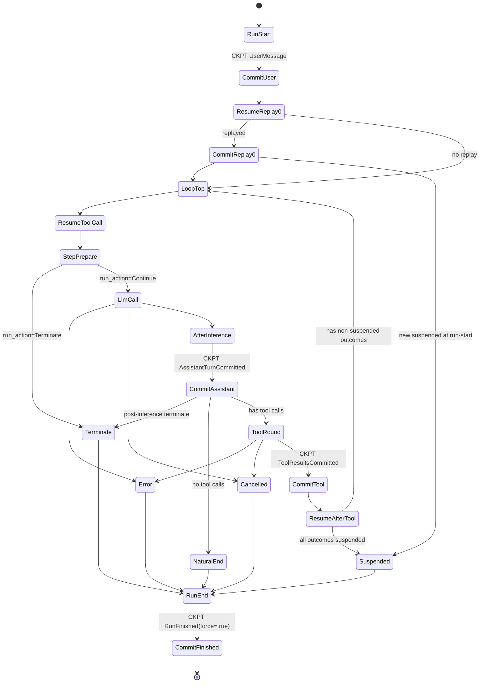
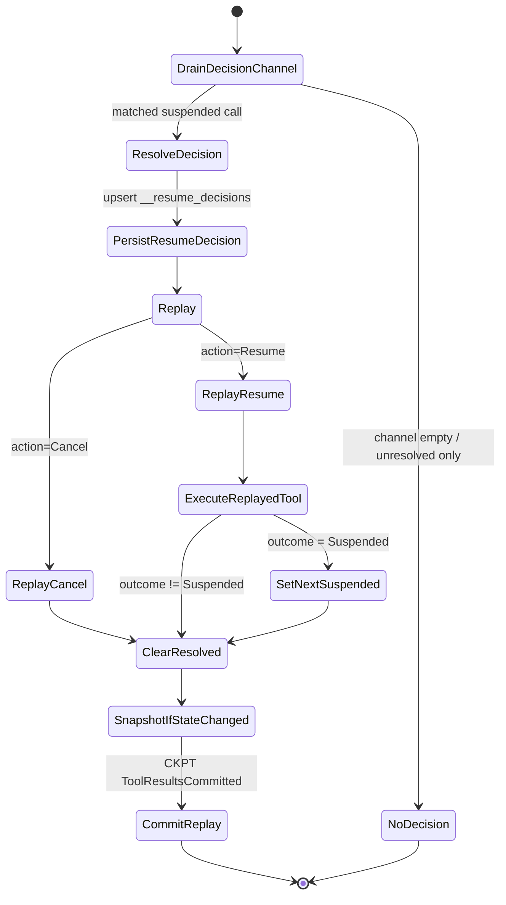
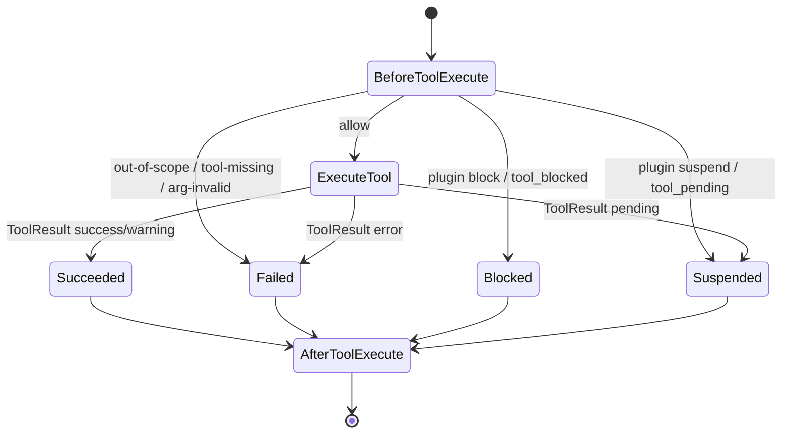

# Run Lifecycle and Phases

The runtime executes one run as a phase-driven loop.

## Canonical Top-Level Flow

1. `RunStart`
2. `commit(UserMessage)` + optional resume replay (`drain_resume_decisions_and_replay`)
3. Loop:
   - `RESUME_TOOL_CALL` (apply inbound decisions + replay if any)
   - `StepStart`
   - `BeforeInference`
   - `LLM_CALL`
   - `AfterInference`
   - `StepEnd`
   - Optional `TOOL_CALL` round:
     - `BeforeToolExecute`
     - Tool execution
     - `AfterToolExecute`
     - apply tool results + commit
     - `RESUME_TOOL_CALL` again (consume decisions received during tool round)
4. `RunEnd`

This loop applies to both `run_loop` and `run_loop_stream`; stream mode adds
extra decision handling windows while inference/tool execution is in-flight.

## State Machine (non-stream canonical)

## Checkpoint Triggers

`StateCommitter` is optional. When configured, checkpoints are emitted at these
boundaries:

1. `UserMessage`
   - Trigger: after `RunStart` side effects are applied.
2. `ToolResultsCommitted` (run-start replay)
   - Trigger: run-start replay actually executed at least one resumed call.
3. `AssistantTurnCommitted`
   - Trigger: each successful `LLM_CALL` result is applied (`AfterInference` + assistant message + `StepEnd`).
4. `ToolResultsCommitted` (tool round)
   - Trigger: each completed tool round is applied to session state/messages.
5. `ToolResultsCommitted` (decision replay in-loop)
   - Trigger: inbound decision resolved and replay produced effects.
6. `RunFinished` (`force=true`)
   - Trigger: any terminal exit path (`NaturalEnd` / `Suspended` / `Cancelled` / `Error` / plugin-requested termination).

## Resume Gate After Tool Commit

After `CommitTool`, the loop does **not** jump directly to `LLM_CALL`. It always
passes through `RESUME_TOOL_CALL` first (`apply_decisions_and_replay`).

Why:

- consume decisions that arrived during tool execution;
- avoid stale `Suspended` evaluation;
- persist replay side effects before the next inference step.

So the transition is:

`CommitTool -> RESUME_TOOL_CALL -> StepStart/BeforeInference -> LLM_CALL`.

## RESUME_TOOL_CALL Sub-State Machine (Decision Replay)

`RESUME_TOOL_CALL` is the decision-drain + replay gate used at loop top and
immediately after tool-round commit.

Notes:

- `NoDecision` exits with no replay commit.
- `CommitReplay` is only triggered when at least one decision is resolved and
  replay path executes.
- The same sub-state machine is reused in:
  - run-start drain path;
  - loop-top `apply_decisions_and_replay`;
  - post-tool `apply_decisions_and_replay`.

## TOOL_CALL Sub-State Machine (Per ToolCall)

Important:

- `Blocked` is a **pre-execution gate** outcome (from `BeforeToolExecute`) and
  is returned to model as `ToolResult::error` with `ToolCallOutcome::Failed`.
- In canonical loop execution, `ExecuteTool` itself does not produce a
  cancellation-flavored per-tool outcome; execution-time cancellation is handled
  at run/tool round level (see below).

## CancellationToken Impact on TOOL_CALL

`CancellationToken` affects TOOL_CALL at **round/executor level**:

- If token is cancelled while waiting tool round completion, executor returns
  cancellation error and run terminates with `TerminationReason::Cancelled`.
- This is not represented as a per-tool blocked/failed gate result.

So there are two different "cancel" semantics:

1. **ToolCallOutcome::Failed**: plugin/tool-gate blocks and returns tool error.
2. **TerminationReason::Cancelled**: external run cancellation token aborts run.

## Parallel Tool Execution and Incoming Resume

### Non-stream (`run_loop`)

- During `tool_executor.execute(...).await`, decision channel is not drained.
- Incoming decisions stay queued.
- They are applied in the immediate post-tool `RESUME_TOOL_CALL` phase.

### Stream (`run_loop_stream`)

- Tool round uses `tokio::select!` over:
  - tool future,
  - activity channel,
  - decision channel.
- Incoming decisions are applied immediately (`apply_decision_and_replay`).
- If a suspended call is already resolved during this window, returned
  suspended result for that call is filtered to avoid duplicate pending events.

## Clarifications for Common Questions

### 1) Tool failure vs loop error

- Tool-level failures (tool not found, arg validation failure, plugin block,
  tool returned error result) are written as tool result messages and the loop
  continues to next inference round.
- Runtime-level errors (tool executor failure, patch/apply failure, checkpoint
  commit failure) terminate with `TerminationReason::Error`.

### 2) `CommitTool` granularity

- `CommitTool` is per **tool round batch** (`Vec<ToolExecutionResult>`), not per
  single tool call.
- In sequential executor, the batch may be a prefix if execution stops at first
  suspended call.

### 3) Why post-tool replay is required

After tool batch commit, loop runs `apply_decisions_and_replay` again to:

- consume decisions that arrived while tools were running;
- prevent stale suspended-state checks;
- make replay side effects durable before next `LLM_CALL`.

### 4) Transition when there are non-suspended tool results

When tool results contain at least one non-suspended outcome, the run does not
terminate. Control returns to loop top:

`CommitTool -> RESUME_TOOL_CALL -> StepStart/BeforeInference -> LLM_CALL`.

## Why This Design

- Phases isolate extension logic in plugins.
- Run termination is explicit via `TerminationReason`.
- Step-local control (tool filtering, pending interactions) is deterministic.
