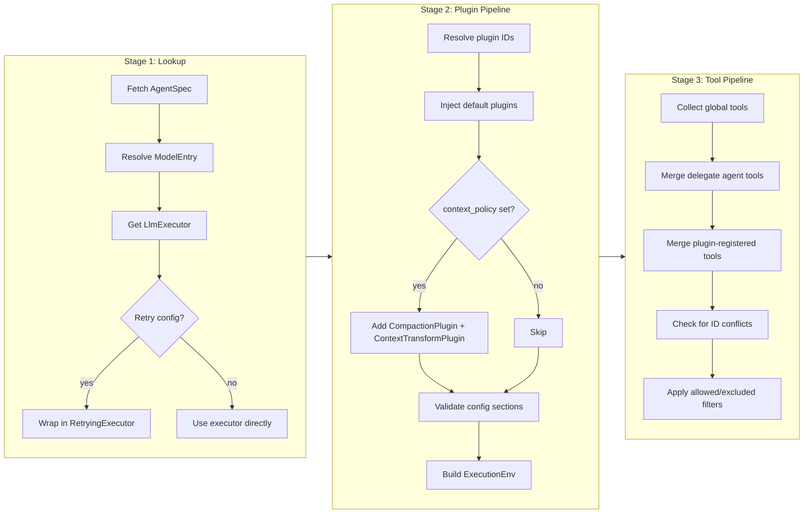

# 智能体解析

当调用 `runtime.run(request)` 时，请求中的 `agent_id` 必须被解析为一个完全装配好的 `ResolvedAgent` -- 一个持有 LLM 执行器、工具、插件和执行环境的活引用的结构体。每次调用 `resolve()` 都会重新执行解析；不会在运行之间缓存或共享任何内容。本文描述三阶段解析流水线及其输入构建器。

## 流水线概览

解析是一个纯函数：`(RegistrySet, agent_id) -> ResolvedAgent`。它按顺序经过三个阶段：

任何阶段的失败都会产生 `ResolveError` 并中止流程。流水线永远不会返回部分结果。

## 阶段 1：查找

第一阶段从注册表中获取原始数据：

1. **AgentSpec** -- 通过 `agent_id` 从 `AgentSpecRegistry` 中查找。如果规格包含 `endpoint` 字段（远程 A2A 智能体），解析会以 `RemoteAgentNotDirectlyRunnable` 失败 -- 远程智能体只能作为委托使用，不能直接运行。

2. **ModelEntry** -- 规格的 `model` 字段（一个字符串 ID，如 `"gpt-4"`）通过 `ModelRegistry` 解析为 `ModelEntry`，将其映射到一个提供者 ID 和实际模型名称（例如，提供者 `"openai"`，模型名称 `"gpt-4-turbo"`）。

3. **LlmExecutor** -- 模型条目中的提供者 ID 通过 `ProviderRegistry` 解析为一个活的 `LlmExecutor` 实例。

4. **重试装饰** -- 如果智能体规格包含 `RetryConfigKey` 配置段，且 `max_retries > 0` 或 `fallback_models` 非空，则执行器会被包装在 `RetryingExecutor` 装饰器中。

## 阶段 2：插件流水线

第二阶段组装插件链并构建执行环境。

### 插件解析

`AgentSpec.plugin_ids` 中列出的插件通过 ID 从 `PluginSource` 解析。缺失的插件会产生 `ResolveError::PluginNotFound`。

### 默认插件注入

解析用户声明的插件后，流水线会注入运行时必需的默认插件。无论智能体如何配置，这些插件始终存在：

- **`LoopActionHandlersPlugin`** -- 注册运行时循环用于处理工具调用、发射事件和管理步骤转换的核心动作处理器。没有此插件，循环无法运行。

- **`MaxRoundsPlugin`** -- 强制执行智能体规格上配置的 `max_rounds` 停止条件。使用规格的 `max_rounds` 值注入。防止失控循环。

### 条件插件

仅当设置了 `AgentSpec.context_policy` 时才添加以下插件：

- **`CompactionPlugin`** -- 管理上下文窗口压缩（当上下文增长过大时对旧消息进行摘要）。使用规格中的 `CompactionConfigKey` 配置段创建，缺失时回退到默认值。

- **`ContextTransformPlugin`** -- 在每次推理请求前应用上下文窗口策略变换（token 计数、截断、提示缓存）。使用 `context_policy` 值创建。

### 构建 ExecutionEnv

插件列表确定后，`ExecutionEnv::from_plugins()` 对每个插件调用其 `register()` 方法并传入 `PluginRegistrar`。插件通过注册器声明：

- 阶段钩子（按阶段回调）
- 调度动作处理器
- 效果处理器
- 请求变换
- 状态键注册
- 工具

结果是一个 `ExecutionEnv` -- 见下文 [ExecutionEnv](#executionenv)。

### 配置验证

插件可以声明 `config_schemas()`，返回一组 `ConfigSchema` 条目。每个条目将一个配置段键与一个 JSON Schema 关联。解析期间，每个声明的 schema 都会针对 `AgentSpec.sections` 中的对应条目进行验证：

- **配置段存在** -- 针对 JSON Schema 进行验证。失败会产生 `ResolveError::InvalidPluginConfig`。
- **配置段缺失** -- 允许。插件应使用合理的默认值。
- **配置段存在但无插件认领** -- 没有插件为其声明 schema。流水线记录一条警告（可能是配置中的拼写错误）。

## 阶段 3：工具流水线

第三阶段从所有来源收集工具并生成最终工具集。

### 工具来源

工具按以下顺序合并：

1. **全局工具** -- 所有通过构建器在 `ToolRegistry` 中注册的工具（例如 `builder.with_tool("search", search_tool)`）。

2. **委托智能体工具** -- 对于 `AgentSpec.delegates` 中的每个智能体 ID，流水线创建一个 `AgentTool`。如果委托有 `endpoint`（远程），则创建远程 A2A 工具。如果是本地的，则创建由解析器支持的本地工具。委托工具需要 `a2a` 功能标志；没有该标志时，委托会被静默忽略并记录警告。

3. **插件注册的工具** -- 插件在 `register()` 期间声明的工具，存储在 `ExecutionEnv.tools` 中。

### 冲突检测

如果插件注册的工具与全局工具具有相同的 ID，解析会以 `ResolveError::ToolIdConflict` 失败。这是有意为之的 -- 静默覆盖会成为难以调试的问题来源。

### 过滤

合并后，应用规格的 `allowed_tools` 和 `excluded_tools` 字段：

- `allowed_tools = None` -- 保留所有工具。
- `allowed_tools = Some(list)` -- 仅保留 ID 出现在列表中的工具。其余全部丢弃。
- `excluded_tools` -- 任何 ID 出现在此列表中的工具都会被移除，即使它在允许列表中。

## ExecutionEnv

`ExecutionEnv` 是插件流水线的每次解析产物。它**不是**全局或共享的 -- 每次 `resolve()` 调用都会构建一个全新的实例。其内容：

| 字段 | 类型 | 用途 |
|---|---|---|
| `phase_hooks` | `HashMap<Phase, Vec<TaggedPhaseHook>>` | 在每个阶段边界调用的钩子 |
| `scheduled_action_handlers` | `HashMap<String, ScheduledActionHandlerArc>` | 用于调度/延迟动作的命名处理器 |
| `effect_handlers` | `HashMap<String, EffectHandlerArc>` | 用于副作用的命名处理器 |
| `request_transforms` | `Vec<TaggedRequestTransform>` | LLM 调用前应用于推理请求的变换 |
| `key_registrations` | `Vec<KeyRegistration>` | 运行开始时安装到状态存储的状态键 |
| `tools` | `HashMap<String, Arc<dyn Tool>>` | 插件提供的工具（在阶段 3 合并到主工具集） |
| `plugins` | `Vec<Arc<dyn Plugin>>` | 用于生命周期钩子的插件引用（`on_activate`/`on_deactivate`） |

每个 `TaggedPhaseHook` 和 `TaggedRequestTransform` 都携带其所属插件的 ID，用于诊断和过滤。

## AgentRuntimeBuilder

构建器（`AgentRuntimeBuilder`）是构造 `AgentRuntime` 的标准方式。它累积五个注册表：

| 注册表 | 构建器方法 | 用途 |
|---|---|---|
| `MapAgentSpecRegistry` | `with_agent_spec()` / `with_agent_specs()` | 智能体定义 |
| `MapToolRegistry` | `with_tool()` | 全局工具 |
| `MapModelRegistry` | `with_model()` | 模型 ID 到提供者 + 模型名称的映射 |
| `MapProviderRegistry` | `with_provider()` | LLM 执行器实例 |
| `MapPluginSource` | `with_plugin()` | 插件实例 |

### 错误处理

构建器使用**延迟错误收集**。每个检测到冲突（重复 ID）的 `with_*` 调用会将 `BuildError` 推入内部错误列表，而不是返回 `Result`。第一个收集到的错误在调用 `build()` 或 `build_unchecked()` 时浮现。

### 验证

`build()` 在构造运行时后对每个已注册的智能体规格执行一次试运行解析。如果任何智能体解析失败（缺失模型、缺失提供者、缺失插件），错误会被收集并作为 `BuildError::ValidationFailed` 返回。这在启动时而非首次请求时捕获配置错误。

`build_unchecked()` 跳过此验证。仅在需要延迟解析或智能体将在构造后动态添加时使用。

### 远程智能体 (A2A)

当启用 `a2a` 功能标志时，构建器支持 `with_remote_agents()` 来注册远程 A2A 端点。这些端点被包装在 `CompositeAgentSpecRegistry` 中，该注册表组合了本地和远程智能体来源。远程智能体通过 `build_and_discover()` 异步发现。

## 另见

- [架构](./architecture.md) -- 系统分层与请求序列
- [Run 生命周期与阶段](./run-lifecycle-and-phases.md) -- 解析之后发生什么
- [工具与插件边界](./tool-and-plugin-boundary.md) -- 何时使用工具 vs 插件
- [设计权衡](./design-tradeoffs.md) -- 关键决策的理由
