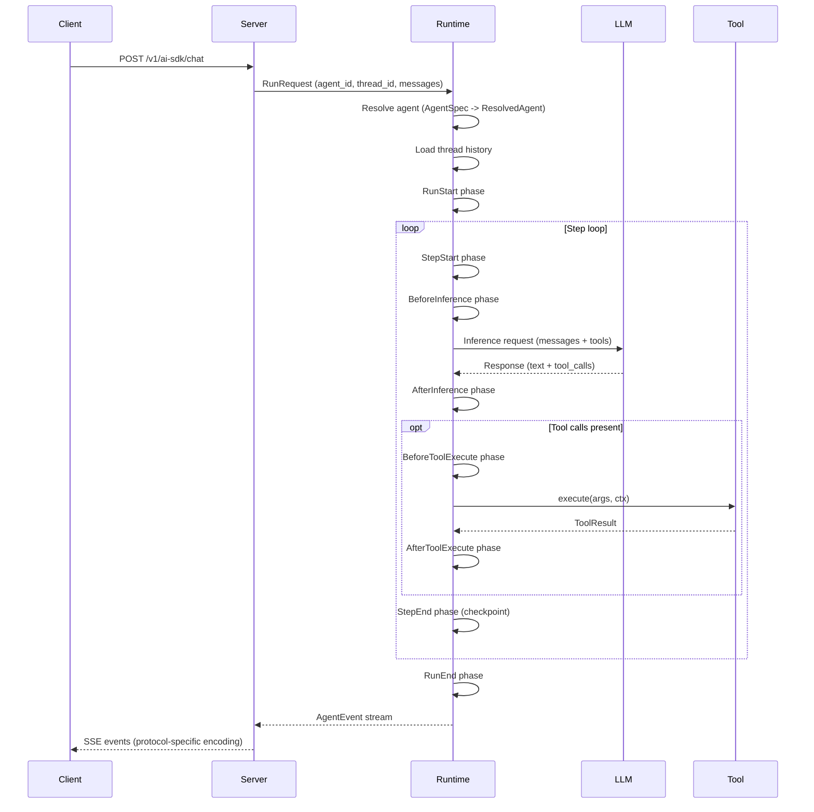

# 架构

Awaken 围绕一个运行时核心及三个外围层面组织：契约类型、服务器/存储适配器以及可选扩展。真正重要的不是 crate 的边界，而是决策在哪里做出。

```text
应用组装
  注册 tool / model / provider / plugin / AgentSpec
        |
        v
AgentRuntime
  解析 AgentSpec -> ResolvedAgent
  从插件构建 ExecutionEnv
  执行 phase loop
  暴露 cancel / decision 等活跃 run 的控制面
        |
        v
服务器与存储表面
  HTTP 路由、mailbox、SSE 回放、协议适配器、
  thread/run 持久化、profile storage
```

**契约层** -- `awaken-contract` 定义全系统共用的类型：`AgentSpec`、`ModelSpec`、`ProviderSpec`、`Tool`、`AgentEvent`、transport trait 以及类型化状态模型。这是系统其余部分共同使用的"词汇表"。

**运行时核心** -- `awaken-runtime` 是编排层。它将 agent ID 解析为完整配置（`ResolvedAgent`），从插件构建 `ExecutionEnv`，管理活跃 run，并将执行委托给循环运行器和阶段引擎。

**服务器与持久化表面** -- `awaken-server` 将运行时转化为 HTTP 和 SSE 端点、基于 mailbox 的后台执行以及协议适配器。`awaken-stores` 提供 thread 和 run 的具体持久化后端。`awaken-ext-*` crate 在阶段和工具边界扩展运行时行为，而不改动核心循环。

## 请求时序

下图展示一个典型请求在系统中的流转过程：



## 阶段驱动的执行循环

每次 run 都经历固定的阶段序列。插件注册在各阶段边界运行的钩子，从而控制推理参数、工具执行、状态变更和终止逻辑。

```text
RunStart -> [StepStart -> BeforeInference -> AfterInference
             -> BeforeToolExecute -> AfterToolExecute -> StepEnd]* -> RunEnd
```

步骤循环持续执行，直到以下任一条件触发：

- LLM 返回不含工具调用的响应（`NaturalEnd`）。
- 插件或停止条件请求终止（`Stopped`、`BehaviorRequested`）。
- 工具调用挂起等待外部输入（`Suspended`）。
- run 被外部取消（`Cancelled`）。
- 发生错误（`Error`）。

在每个阶段边界，循环在继续执行前会检查取消令牌和 run 的生命周期状态。

## 仓库结构

```text
awaken
├─ awaken-contract
│  ├─ registry specs
│  ├─ tool / executor / event / transport contracts
│  └─ state model
├─ awaken-runtime
│  ├─ builder + registries + resolve pipeline
│  ├─ AgentRuntime control plane
│  ├─ loop_runner + phase engine
│  ├─ execution / context / policies / profile
│  └─ runtime extensions (handoff, local A2A, background)
├─ awaken-server
│  ├─ routes + config API + mailbox + services
│  ├─ protocols: ai_sdk_v6 / ag_ui / a2a / mcp / acp-stdio
│  └─ transport: SSE relay / replay buffer / transcoder
├─ awaken-stores
└─ awaken-ext-*
```

## 设计意图

三项原则指导整体架构：

**快照隔离** -- 阶段钩子永远看不到部分应用的状态。它们从不可变快照中读取，并向 `MutationBatch` 写入。在一个阶段的所有钩子收敛后，批次被原子性地提交。这消除了并发钩子之间的数据竞争，使钩子的执行顺序对正确性无关紧要。

**追加式持久化** -- Thread 消息仅追加，不修改。状态在步骤边界做检查点。这使得从任意检查点重放 run 成为可能，并产生确定性的审计轨迹。

**传输无关性** -- 运行时通过 `EventSink` trait 发出 `AgentEvent` 值。协议适配器（`AiSdkEncoder`、`AgUiEncoder`）将这些事件转码为具体的传输格式。运行时对 HTTP、SSE 或任何具体协议一无所知。添加新协议意味着实现一个新的编码器——运行时本身无需改变。

## 另见

- [Run 生命周期与阶段](./run-lifecycle-and-phases.md) -- 阶段执行模型
- [状态与快照模型](./state-and-snapshot-model.md) -- 快照隔离详解
- [设计权衡](./design-tradeoffs.md) -- 关键架构决策的理由
- [工具与插件边界](./tool-and-plugin-boundary.md) -- 插件与工具的设计边界
