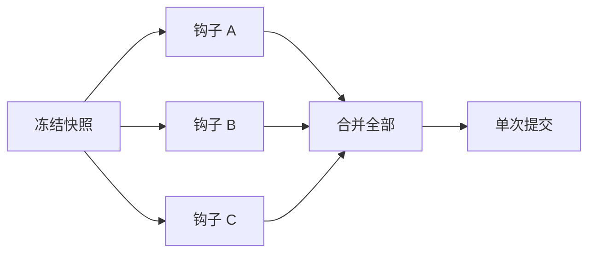
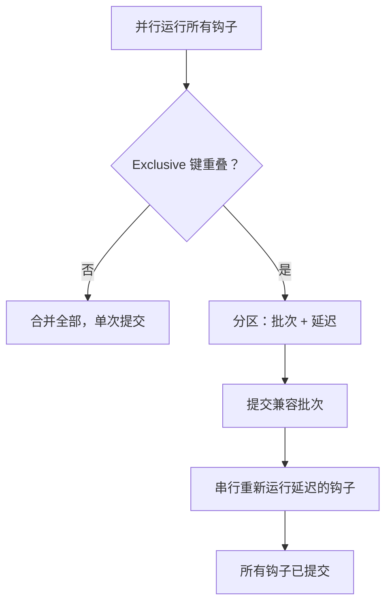
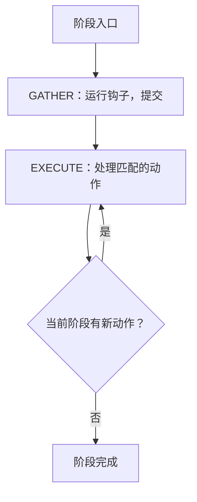
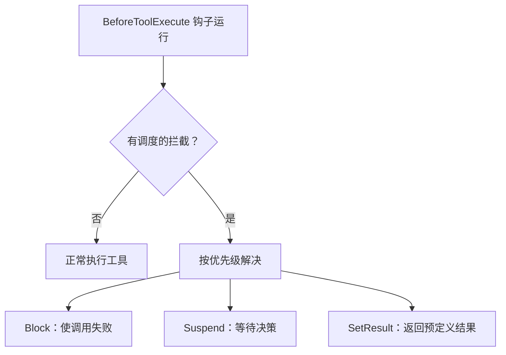

# 插件系统内部机制

本文介绍插件系统的内部运作机制：插件如何注册和激活、钩子如何执行和解决冲突、阶段收敛循环的工作原理，以及请求变换、效果、推理覆盖和工具拦截在运行时的行为。

关于工具与插件的高层边界，参见 [Tool and Plugin Boundary](./tool-and-plugin-boundary.md)。关于阶段生命周期，参见 [Run Lifecycle and Phases](./run-lifecycle-and-phases.md)。

## 插件注册与激活

当插件被加载时，其 `register()` 方法会以 `PluginRegistrar` 为参数被调用。插件声明两类组件：

**结构组件** 始终可用，不受激活状态影响：

- 状态键（`register_key::<K>()`）
- 调度动作处理器（`register_scheduled_action::<A, H>()`）
- 效果处理器（`register_effect::<E, H>()`）

**行为组件** 仅在插件通过激活过滤器时才处于活跃状态：

- 阶段钩子（`register_phase_hook()`）
- 工具（`register_tool()`）
- 请求变换（`register_request_transform()`）

激活由 `AgentSpec.active_hook_filter` 控制：

| `active_hook_filter` 值 | 行为 |
|---|---|
| 空（默认） | 所有插件的行为组件均处于活跃状态 |
| 非空集合 | 仅 ID 在集合中的插件贡献行为组件 |

这种分离使得基础设施插件（状态管理、动作处理器、效果处理器）可以存在而不影响执行流。例如，一个仅注册效果处理器的日志插件永远不需要出现在 `active_hook_filter` 中——只要任何插件发出对应的效果，其处理器就会触发。

过滤逻辑在 `PhaseRuntime::filter_hooks()` 中实现：

```rust,ignore
fn filter_hooks<'a>(env: &'a ExecutionEnv, ctx: &PhaseContext) -> Vec<&'a TaggedPhaseHook> {
    let hooks = env.hooks_for_phase(ctx.phase);
    let active_hook_filter = &ctx.agent_spec.active_hook_filter;
    hooks
        .iter()
        .filter(|tagged| {
            active_hook_filter.is_empty()
                || active_hook_filter.contains(&tagged.plugin_id)
        })
        .collect()
}
```

## 钩子排序与冲突解决

多个插件可以为同一 `Phase` 注册钩子。引擎通过 `gather_and_commit_hooks()`（`crates/awaken-runtime/src/phase/engine.rs`）中实现的两阶段流程来处理它们。

### 快速路径：并行执行，单次提交

同一阶段的所有钩子针对一份**冻结快照**并行运行。每个钩子接收相同的快照并产生一个 `StateCommand`。如果没有钩子写入另一个钩子也写入的 `MergeStrategy::Exclusive` 键，则所有命令在单次批处理中合并并提交。



### 冲突回退：分区与串行重试

如果两个或更多钩子写入同一个 `Exclusive` 键，引擎检测到冲突并回退：

1. **分区** —— 按注册顺序遍历命令。贪心地将每个命令添加到"兼容批次"中，前提是其 `Exclusive` 键与批次中已有的键不重叠。否则，延迟该钩子。
2. **提交批次** —— 合并并提交兼容批次。
3. **串行重新执行** —— 延迟的钩子逐个重新运行，每个钩子基于包含所有先前提交结果的**新鲜快照**执行。



由于钩子是纯函数（冻结快照输入，`StateCommand` 输出，无副作用），冲突时的重新执行始终是安全的。延迟的钩子能看到批次提交后的更新状态，因此即使原始并行执行会产生冲突，它们也能产生正确的结果。

关于 `MergeStrategy` 和快照隔离的详细信息，参见 [State and Snapshot Model](./state-and-snapshot-model.md)。

## 阶段收敛循环

每个阶段运行一个 **GATHER 然后 EXECUTE** 的循环，当没有新工作时收敛。

### GATHER 阶段

并行运行所有活跃钩子（按上述冲突解决方式处理）。钩子产生的 `StateCommand` 值可能包含：

- 状态变更（键更新）
- 调度动作（在 EXECUTE 阶段处理）
- 效果（提交后立即派发）

### EXECUTE 阶段

处理待执行的调度动作，这些动作的 `Phase` 匹配当前阶段且其动作键有已注册的处理器。每个动作处理器基于新鲜快照运行，并产生自己的 `StateCommand`，该命令可能为同一阶段调度**新的**动作。

如果处理后出现新的匹配动作，循环重复：



循环受 `DEFAULT_MAX_PHASE_ROUNDS`（16）限制。如果动作数量在此限制内未收敛，引擎返回 `StateError::PhaseRunLoopExceeded`。这可以防止无限反应链，同时允许合法的多步动作级联。

这种收敛设计支持反应式模式：权限检查动作可以在同一个 `BeforeToolExecute` 阶段调度暂停动作，两者在阶段完成前均被处理。

## 请求变换钩子

插件可以通过 `registrar.register_request_transform()` 注册 `InferenceRequestTransform` 实现。变换在请求到达 LLM 执行器之前修改 `InferenceRequest`。

用例：

- **系统提示注入** —— 向系统消息追加上下文、指令或提醒
- **工具列表修改** —— 过滤、重排序或增强发送给 LLM 的工具描述符
- **参数覆盖** —— 调整温度、最大 token 数或其他推理参数

变换按注册顺序运行，且可组合：每个变换接收经前一个变换修改后的请求。

仅活跃插件的变换会被应用。如果 `active_hook_filter` 非空，则不在过滤器中的插件的变换会被跳过。

## 效果处理器

效果是通过 `EffectSpec` trait 定义的类型化事件：

```rust,ignore
pub trait EffectSpec: 'static + Send + Sync {
    const KEY: &'static str;
    type Payload: Serialize + DeserializeOwned + Send + Sync + 'static;
}
```

钩子和动作处理器通过在 `StateCommand` 上调用 `command.emit::<E>(payload)` 来发出效果。与调度动作（在特定阶段的收敛循环中执行）不同，效果在命令**提交到存储之后**派发。

插件通过 `registrar.register_effect::<E, H>(handler)` 注册效果处理器。当效果被派发时，引擎使用效果载荷和当前快照调用处理器。

关键特性：

- **即发即忘** —— 处理器失败会被记录日志，但不会阻塞执行或回滚提交。
- **提交后执行** —— 效果看到的是发出它们的命令已被应用后的状态。
- **提交时验证** —— 如果命令发出的效果没有已注册的处理器，`submit_command` 立即返回 `StateError::UnknownEffectHandler`，防止静默丢弃。

用例：审计日志、指标发送、跨插件通知、外部系统同步。

## InferenceOverride 合并

多个插件可以通过调度 `SetInferenceOverride` 动作来影响推理参数。`InferenceOverride` 结构体使用**按字段后写入者胜出**的合并语义：

```rust,ignore
pub struct InferenceOverride {
    pub model: Option<String>,
    pub fallback_models: Option<Vec<String>>,
    pub temperature: Option<f64>,
    pub max_tokens: Option<u32>,
    pub top_p: Option<f64>,
    pub reasoning_effort: Option<ReasoningEffort>,
}
```

当两个覆盖被合并时，每个字段独立取最后一个非 `None` 的值：

```rust,ignore
pub fn merge(&mut self, other: InferenceOverride) {
    if other.temperature.is_some() {
        self.temperature = other.temperature;
    }
    if other.max_tokens.is_some() {
        self.max_tokens = other.max_tokens;
    }
    // ... 所有字段同理
}
```

这允许插件覆盖特定参数而不影响其他参数。成本控制插件可以设置 `max_tokens`，而质量插件设置 `temperature`，两者互不干扰。如果两者设置同一字段，最后一次合并胜出。

## 工具拦截优先级

在 `BeforeToolExecute` 阶段，插件可以调度 `ToolInterceptAction` 来控制工具执行流。动作载荷是以下三个变体之一：

```rust,ignore
pub enum ToolInterceptPayload {
    Block { reason: String },
    Suspend(SuspendTicket),
    SetResult(ToolResult),
}
```

当多个拦截被调度给同一个工具调用时，按隐式优先级解决：

| 优先级 | 变体 | 行为 |
|--------|------|------|
| 3（最高） | `Block` | 终止工具执行，使调用失败 |
| 2 | `Suspend` | 暂停执行，等待外部决策 |
| 1（最低） | `SetResult` | 以预定义结果短路返回 |

最高优先级的拦截胜出。如果两个拦截具有相同优先级（例如，两个插件都调度了 `Block`），第一个被处理的生效，冲突被记录为错误。

如果没有调度拦截，工具正常执行（隐式放行）。



## 另见

- [Tool and Plugin Boundary](./tool-and-plugin-boundary.md) —— 何时使用工具 vs 插件
- [Run Lifecycle and Phases](./run-lifecycle-and-phases.md) —— 阶段排序与终止
- [State and Snapshot Model](./state-and-snapshot-model.md) —— 合并策略、作用域、快照隔离
- [Scheduled Actions Reference](../reference/scheduled-actions.md) —— 动作处理器注册
- [HITL and Mailbox](./hitl-and-mailbox.md) —— 暂停与恢复流程
